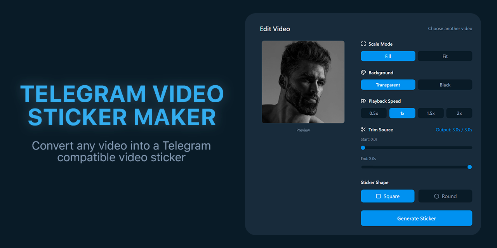

# Telegram Video Sticker Maker

Web application for creating video stickers for Telegram. Converts any video into `.webm` format compatible with Telegram's video sticker requirements.



## Features

- ✂️ **Video trimming** — select up to 3 seconds clip
- 🎭 **Sticker shape** — square or round
- 🎨 **Background** — transparent or black
- ⚡ **Playback speed** — 0.5x, 1x, 1.5x, 2x
- 📐 **Scaling** — fill or fit
- 📤 **Export** — ready-to-use .webm file

## Tech Stack

- **HTML5** — semantic markup
- **CSS3** — custom styling with CSS variables
- **JavaScript (Vanilla)** — no frameworks, pure ES6+
- **Tailwind CSS (CDN)** — utility-first styling
- **Lucide Icons** — icon library
- **MediaRecorder API** — video encoding
- **Canvas API** — frame-by-frame video processing

## Architecture

```
sticker-maker/
├── index.html      # Main HTML structure, UI components
├── style.css       # Custom styles (checkerboard pattern, animations, range inputs)
├── script.js       # Application logic, video processing, recording
├── README.md       # Documentation
└── image.png       # Project preview image
```

## Technical Implementation

### Video Processing Pipeline

1. **File Upload** — Video file is loaded via `URL.createObjectURL()` for local preview
2. **Canvas Rendering** — Each frame is drawn on a 512x512 canvas with applied transformations:
   - Scaling (fill/fit modes)
   - Circular mask (for round stickers)
   - Background color (transparent/black)
3. **Frame Capture** — Canvas stream captured at 30 FPS via `canvas.captureStream(30)`
4. **Encoding** — `MediaRecorder` encodes frames to VP9 WebM format at 400 kbps
5. **Export** — Recorded chunks are combined into a Blob and exported as downloadable file

### Key APIs Used

| API | Purpose |
|-----|---------|
| `MediaRecorder` | Records canvas stream to WebM |
| `CanvasRenderingContext2D` | Draws and transforms video frames |
| `URL.createObjectURL` | Creates blob URLs for video preview |
| `requestAnimationFrame` | Smooth frame-by-frame rendering |
| `Drag & Drop API` | File upload handling |

### Telegram Sticker Requirements

The encoder is configured to meet Telegram's specifications:
- **Resolution:** 512x512 pixels
- **Format:** WebM (VP9 codec)
- **Duration:** ≤ 3 seconds
- **Frame rate:** 30 FPS
- **Bitrate:** ~400 kbps

## Usage

### 1. Upload Video

Drag & drop a video file or click to select.

### 2. Configure Sticker

- **Trim** — set start/end points (max 3s output)
- **Scale Mode** — Fill (crop) or Fit (letterbox)
- **Background** — Transparent or Black
- **Speed** — adjust playback speed
- **Shape** — Square or Round

### 3. Generate & Download

Click **Generate Sticker**, wait for processing, then download the `.webm` file.

### 4. Add to Telegram

1. **Open the Bot:** Go to the official [@Stickers](https://t.me/Stickers) bot on Telegram.
2. **Choose an Action:**
   * To create a **new** pack: Type the `/newvideo` command.
   * To add to an **existing** pack: Type the `/addsticker` command.
3. **Select your Pack:** If adding to an existing set, select it from the list provided by the bot.
4. **Upload the File:** Send your `.webm` file **as a document** (uncompressed).
5. **Assign Emojis:** Send 1 or 2 emojis that correspond to this sticker.
6. **Finalize:**
   * If creating a new pack, type `/publish` and follow the bot's instructions to set a short URL name.
   * If just adding a sticker, type the `/done` command.

Done! Your sticker is ready to use.

## Local Development

No build step required. Open `index.html` in a browser or serve locally:

```bash
python -m http.server 8000
# Open http://localhost:8000
```